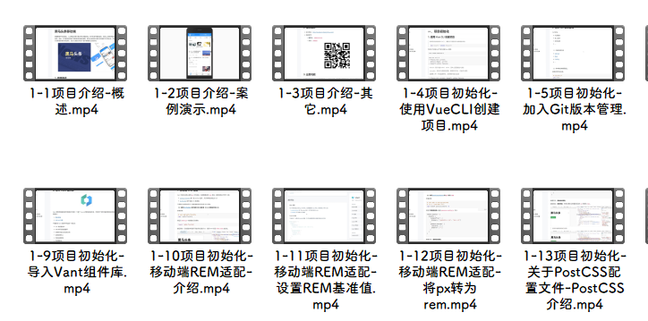
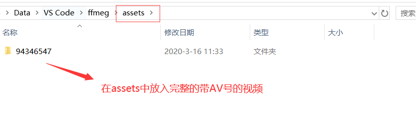
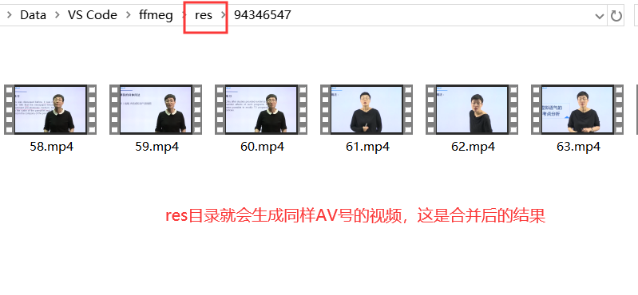

>由于需要电脑播放B站缓存的视频，而B站缓存的视频（位置：`/device/Android/data/tv.danmaku.bili/download/{avid}`）是.m4s格式的，音频和视频分离。目前没有播放器可以识别，因此我想到了利用FFmeg来处理合并。


### 提示

我发现B站最近才转成.m4s格式，也就是以前.blv分片的这个无法处理，只能处理.m4s格式的视频音频!!!

同时，保证电脑安装了 [FFmeg]( https://www.ffmpeg.org/download.html )，安装过后需要将`/bin`加入环境变量。


### 更新（2021-9-1）

生成文件名由小标题代替




### 使用方法

#### 0. 注意

请将需要合并的视频文件放入`./assets`中，合并后的文件会存放在`./res`中（请先创建assets和res文件夹）




#### 1. 安装

```bash
# Clone this repository
git clone https://github.com/inf-xu/ffmeg-m4s.git
```

#### 2. 初始化

```bash
# Install dependencies
npm install
```

#### 3. 运行

```bash
# Run the app
node main.js
```

#### 4. 自定义参数

```bash
# Specify i/o path and verbose log 
node main --assets=C:\\Users\\lawsssscat\\Downloads\\1076105 -r C:/Users/lawsssscat/Downloads/12 -V
# Detail see help
node main --help
```
